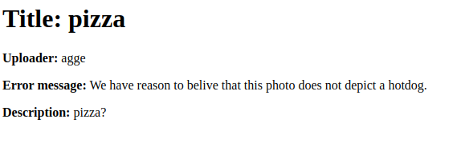

## Setup
* Create a virtualenv and activate in the project root.
* Install requirements from the requirements.txt file.
* [Setup a rabbitmq-server](https://www.rabbitmq.com/install-debian.html#apt-quick-start-cloudsmith) litsening on port 5672 (default).
* The classifier network is pre-trained. But you can re-train if you want. There is a script for training under classifier/ __It's based on Tensorflow v1 though so you'll have to fox compatability__

#### To test project features:

1. Run migrations
```bash
$ python manage.py migrate
```
2. Create a superuser
```bash
$ python manage.py createsuperuser
```
3. Run site with 
```bash
$ python manage.py runserver
```
4. Open site,login and upload new photo (jpg, png, bmp or gif). This will take
   you to the photos detail page. Keep that open.

5. In a new terminal window, navigate to site root, activate env and run 
```bash
$ python ./classifier/photo_consumer.py
```
* The process will print out some status and the classifier's results.

* If rhe result for "hotdogs" was <= 0.95 you can refresh the photo's detail 
   page and there should be a text saying that the image 
   doesn't depict a hotdog - assuming you have everything setup properly.



## In depth stuff
#### Start new app

1. You need to first create a directory appname inside project
```bash
$ mkdir /photo_sharing_site/appname 
```
2. Then, run the startapp command to create the app.
```bash
$ django-admin.py startapp appname ./photo_sharing_site/appname
```
#### API endpoints

GET:
```bash
api/photos/
api/photos/uuid/
```
POST:
```bash
api/photos/
```
PUT:
```bash
api/photos/uuid/photo/
api/photos/uuid/flagged/
```
E.g.:
```bash
curl -X PUT -d 'flagged=true' --user agge:123Hejsan http://127.0.0.1:8000/api/photos/cf134197-4ed8-4bdf-b322-cc2ba82e6335/flagged/ 
```

#### Sources

https://medium.com/backticks-tildes/lets-build-an-api-with-django-rest-framework-32fcf40231e5

http://www.django-rest-framework.org/

https://developer.mozilla.org/en-US/docs/Learn/Server-side/Django/Tutorial_local_library_website

https://stackoverflow.com/questions/10382838/how-to-set-foreignkey-in-createview

https://stackoverflow.com/questions/24201676/how-can-i-test-binary-file-uploading-with-django-rest-frameworks-test-client

https://www.tensorflow.org/hub/tutorials/image_retraining

#### Create photo object from shell
```bash
$ python manage.py shell
>>> from django.contrib.auth.models import User
>>> from photo_sharing_site.photos.models import Photo
>>> from django.core.files import File
>>> photoTesting=Photo(title='TestingTesting', description='tortillas', owner=User.objects.get(username='agge'))
>>> photoTesting.photo.save('tortil.jpg', File(open('assets/images/9.jpg', 'rb')))
>>> photoTesting.save()
```
Now tortil.jpg should have been placed in location defined in Photo model, and the image should be visible at the homepage.

#### Clear Rabbit queue
```bash
$ rabbitmqadmin delete queue name=name_of_queue
```